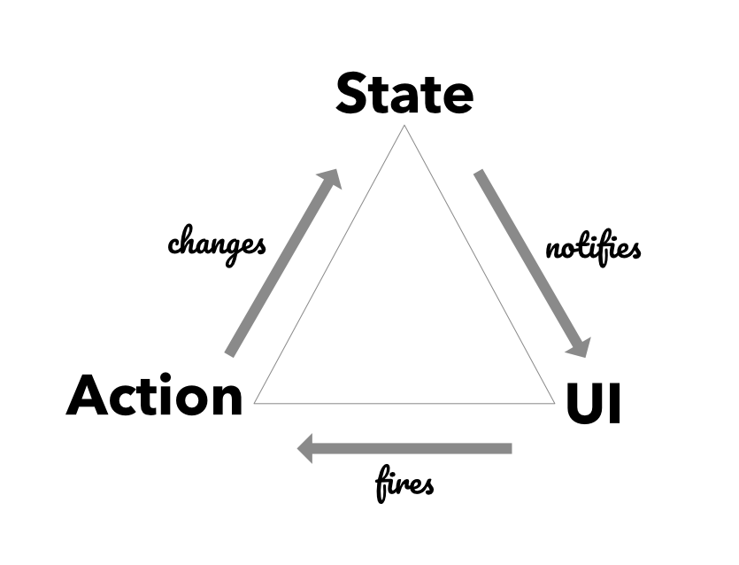
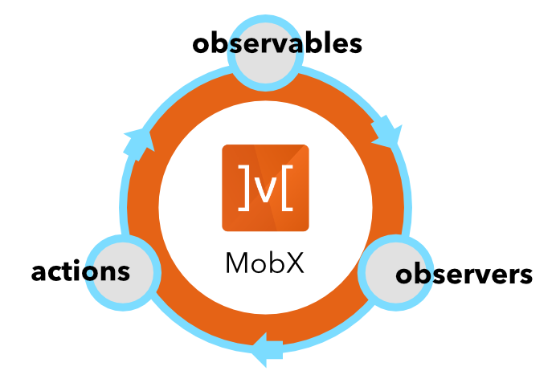

# MobX Quick Start Guide

**State Management** is an aspect of your application that controls what is ultimately rendered. It's the pumping heart that spreads data across your app and brings various components to life. The _state_ of a Web Application, like the ones built with `React.js`, rely on the central _Store_ as the _single source of truth_. _Actions_ originating in the _UI_ are fired on this store to modify the state. This results in a new version of the state, which is notified back to the UI by the Store. This cycle of _Actions --> Store --> UI_ is always uni-directional and makes it easy to understand the data-flow in the application.



## Jumping into MobX

MobX embraces this idea and provides a model of Transparent Functional Reactive Programming (TFRP) that eliminates much of the boilerplate in setting up this data-flow. MobX is a state-management framework that comes with a simple, yet powerful set of building blocks, such as _Observables_, _Actions_ and _Reactions_. These three concepts form the junctions of the data-flow triad.



**Observables** carry the central mutable-state of your application. As this state changes, it fires notifications that can be observed by other participants (aka observers) of the data-flow triad. **Reactions** are the primary observers in MobX. The UI (React Components) is modeled as a _reaction_ and happens to be the most glorious observer in the system. These components observe the _observable-state_ and render the visual representations of data.

> Reacting to a change in observable-state is also known as a **_side-effect_**. The UI is the most visible _side-effect_ in your application.

With `observables` carrying the reactive, mutable state of your application and `reactions` acting as the side-effects, we are missing the third piece: **actions**. Actions are the mutating functions that cause the real changes to the observable state. A React Component cannot (and should not) modify the mutable state directly. Instead, it fires `actions`, which internally cause the desired changes to the observables.

## State Management is hard

As your application scales in size, it becomes necessary to pay close attention to how state is being changed from different parts of your application. It is quite common to have several async operations going on in your app, such as network calls, timers or promise-based operations. Managing the success, failure states of these operations and ensuring that the UI is not going out of sync, can become challenging. With MobX, you can map these to a set of observables, actions and reactions and wire them together without much boilerplate.

Consider this snippet of MobX that wires a `TodoComponent` (the UI, aka reaction) to a `TodoStore` (the observable). By firing _actions_ from the UI, we mutate the state of the Todo, which gets observed by `TodoComponent` to re-render the state.

> See the example live on [CodeSandbox](https://codesandbox.io/s/m4my65o63p)

```jsx
import React, { Fragment } from 'react';
import ReactDOM from 'react-dom';
import { observable, action, computed, reaction } from 'mobx';
import { observer, inject, Provider } from 'mobx-react';
import './styles.css';

class TodoStore {
    @observable
    done = false;

    @observable
    title = '';

    @computed
    get json() {
        return {
            done: this.done,
            title: this.title,
        };
    }

    constructor() {
        reaction(
            () => this.json,
            json => {
                /* Make call to save on server */
            },
        );
    }

    @action
    toggleDone = () => {
        this.done = !this.done;
    };

    @action
    setTitle(title) {
        this.title = title;
    }
}

@inject(stores => ({ todo: stores.store }))
@observer
class TodoComponent extends React.Component {
    render() {
        const { json, done, title } = this.props.todo;

        return (
            <Fragment>
                <div
                    style={{
                        display: 'flex',
                        flexDirection: 'row',
                        alignItems: 'center',
                    }}
                >
                    <input
                        type="checkbox"
                        checked={done}
                        onChange={store.toggleDone}
                    />
                    <input
                        type="text"
                        style={{ flex: 1 }}
                        value={title}
                        onChange={event => store.setTitle(event.target.value)}
                    />
                </div>

                <pre>{JSON.stringify(json)}</pre>
            </Fragment>
        );
    }
}

const store = new TodoStore();
class App extends React.Component {
    render() {
        return (
            <Provider store={store}>
                <TodoComponent />
            </Provider>
        );
    }
}

ReactDOM.render(<App />, document.getElementById('root'));
```

Notice the use of decorators such as `@observable`, `@action`, `@observer` and `@inject` that sets up the connections between the Store, React Components and the firing of actions. This is the minimal and essential boilerplate you have to write to create a React Component that automatically re-renders itself anytime the `done` or `title` properties change.

You can also see the use of `@computed`, a special decorator that automatically tracks its dependent observables and produces up-to-date values. Such properties are called _computed-properties_ or _derivations_ in MobX. Derivations are just _Reactions in disguise_.

In the _constructor_ of the `TodoStore`, we have setup a simple reaction that monitors the computed `json` property. When it changes, it fires a network call to persist the todo on the server. The `json` property internally tracks the `done` and `title` properties and changes whenever any of them change.

The `reaction()` in this case runs a _"persist to server"_ _side-effect_ whenever the `json` property changes. It can also track if the call completely successfully or failed due to various reasons. To do that we can simply keep an _observable_ property called `status`, which can take one of three values: `'pending' | 'completed' | 'failed'`.

The code could look something like below:

```jsx
class TodoStore {
    /* ... */

    @observable
    status = '';

    constructor() {
        reaction(
            () => this.json,
            async json => {
                this.status = 'pending';
                try {
                    await persistTodo(json);
                    this.status = 'completed';
                } catch (e) {
                    this.status = 'failed';
                }
            },
        );
    }

    /* ... */
}
```

The `TodoComponent` can track this in its `render()` and show the `status` as it changes.

## Scaling the app

The example above was fairly simple and was meant to introduce the concepts behind MobX. A real-world application would be much more complex with multiple stores and interconnected relationships between stores. There will be several reactions (aka side-effects) firing as the state changes in the app. Managing all these is definitely not easy but certainly made simpler with MobX.

What is interesting is the mental model you need to develop to handle the growing complextity is exactly the same for the simple `TodoStore` we saw above. So the learning curve stays relatively flat and it becomes a pleasure to scale the app and add more features.


To get you up to speed with MobX and also learn all the practices for developing large scale app, take a look at [MobX Quick Start Guide](https://www.packtpub.com/web-development/mobx-quick-start-guide). Although the title suggests a "quick start", it goes quite deep and even touches on the inner workings of the MobX system.
